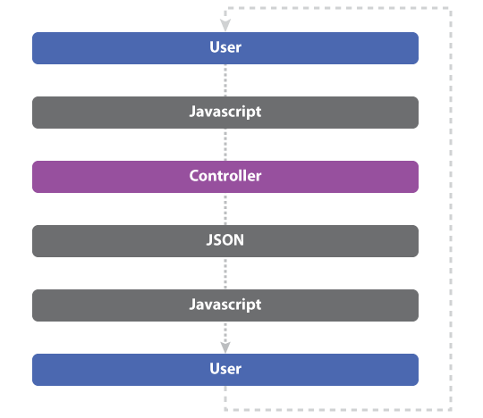

# Angular On Rails

## Learning objectives
- Give an example of when and why one might choose to put an Angular app on Rails.
- Explain whether a given file should be placed in `app/assets`, `lib/assets`, `vendor/assets`, or `public/`.
- Describe the difference between putting a static file in the asset pipeline versus in the `public` folder.
- Cause a certain Rails controller action to respond differently to both HTML and JSON requests.

## Framing

### Rails vs Angular

So far we've seen Angular apps with no back-end framework, and Rails apps with no front-end framework. Now we're going to combine the two and look at a Rails app that runs Angular.

This is different from an Angular app that uses someone else's server to access data. We're going to create an Angular app that is "served" from the same server that provides the data.

### Why?

In a typical Rails app the user interacts with data through links, forms, and Javascript.

In an Angular-on-Rails app the user interacts with data just through Javascript.

This means they have a "single point of contact" with your data. This has two advantages: the user experience may have more consistency, and you have fewer moving parts to worry about.

The main disadvantage is it involves writing a lot more Javascript.

### Single-page on multi-page

The app we're creating today will be a single-page app that is part of a greater multi-page app -- like Google Maps is part of Google.

We'll cover how to make specific assets -- specific stylesheets and Javascripts -- apply to specific pages. Until now, every page in your Rails apps used the same stylesheet.

## [Walkthrough: Inventory Tracker](walkthrough.md)

## References
