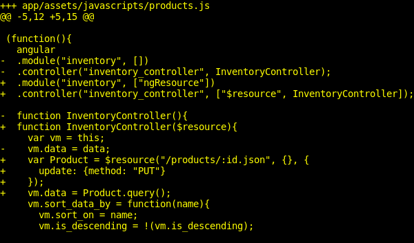
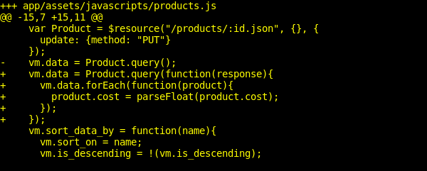
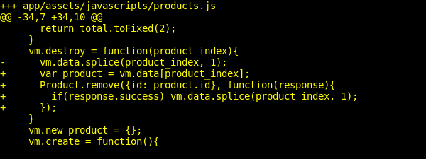
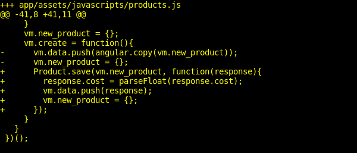
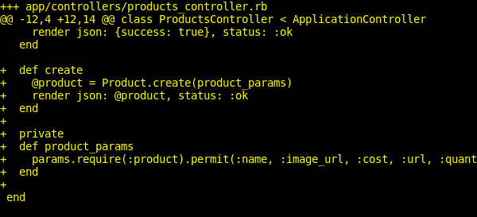
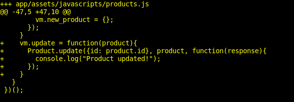
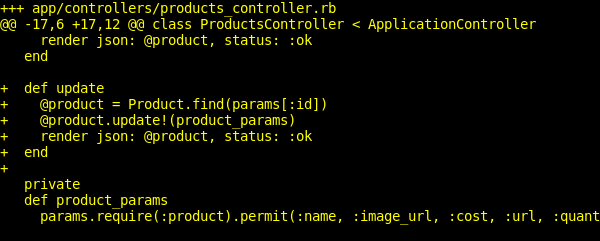

# Walkthrough

## See the working solution here:

https://wdi-inventory-tracker.herokuapp.com/products

## Setup

Clone down this repo:

https://github.com/ga-wdi-exercises/inventory_tracker/tree/rails-solution

Checkout the `angular-solution` branch.

Play with it for a minute to re-familiarize yourself.

This is an Angular app that has no data persistence: when you refresh the page, all your changes are gone.

Your goal is to put this app "on Rails".

## Commit: Rails new

Turn this directory into a Rails app:

```
$ rails new . -d postgresql
```

## Commit: Move the Inventory Tracker files to their appropriate Rails locations

### Read first:

We'll be using the Inventory Tracker as the "index" page for a Product model.

We'll be turning the `data.js` file into a JSON file, which we'll use for seed data.

As for `app.js`, `angular.js`, and `bootstrap.css`, you may notice several other places you may put assets. Each is intended for different types of code:

- `app/assets`: Code that is specific to certain models in your app: for example, the CSS and JS just for your Product model would go in `product.css` and `product.js`. Putting everything in `application.js` and `application.css` is technically a bad practice (but is just fine for small, simple apps).
- `lib/assets`: Libraries that you write yourself. For instance, if you wrote a whole bunch of helper Javascript functions for your Rails app (code that you would use on multiple pages that isn't specific to one model) you might put it here.
- `vendor/assets`: Third-party libraries, like jQuery, Angular, D3, Bootstrap, Foundation, and so on. "Vendor" means third-parties that provide you with code (not someone selling you stuff).
- `public/`: Rarely used (directly). Where your assets go in production after being compiled. Anything in `public` is accessible by going to `localhost:3000/the_file.whatever`. For example, `public/404.html` is accessible at `localhost:3000/404.html` (so when you want to customize your error pages, you do it here). HTML in `public/` has access only to those assets that are also in `public`.

[More information here.](http://guides.rubyonrails.org/asset_pipeline.html#asset-organization)

### Then, move these files to their appropriate locations:

```
app.js        => app/assets/javascripts/products.js
index.html    => app/views/products/index.html.erb
data.js       => db/products_data.json
angular.js    => vendor/assets/javascripts/angular.js
bootstrap.css => vendor/assets/stylesheets/bootstrap.css
```

## Commit: Define an index route for products


View the page in your browser.

#### Think: What URL will you need to go to? You haven't defined a root URL!

"View Source" and validate the HTML.

#### Think: Why aren't assets working?

# STOP
-----

## Commit: Make Product#index -- and Product#index only -- use those assets

We don't want the Inventory Tracker Angular stuff to be loaded on every page -- just the Products#index page. Loading it on every page would be grossly inefficient since we want to use it only on one page.

The Rails "Asset Pipeline" loads, consolidates, and minifies assets (Javascript, CSS, etc). Out-of-the-box, it takes all your Javascript and puts it in one file, and takes all your CSS and puts it in one file. This is called "precompiling".

We no longer want to do this.

### First, tell Rails to *not* automatically put all the CSS and JS into one file


### Second, include the third-party libraries

Using the same formats as in `application.js` and `application.css` (they're each a little different because they're different languages), you can "require" any file that's in any of the "assets" folders, including `vendor/assets`. This will cause it to be included in the precompilation.

Make the `products.js` include Angular, and create a `products.css` that includes Bootstrap.


### Third, tell Rails to precompile the Product CSS and JS files

Rails does not automatically precompile all of your assets.

Read the comment at the end of `config/initializers/assets.rb`.


### Fourth, include the Product JS and CSS files in your Product#index view

Also, **make the HTML valid**. Remember that *everything* in this file will be inserted into `layouts/application.html.erb` (which we're not touching at all). You don't want a `<body>` inside a `<body>`.


Because these `<link>` tags aren't in the `<head>`, they won't validate. In order to make them validate you can add a `property="stylesheet"` attribute.

### Fifth, restart your server

Rails won't pick up all these changes automatically.

# STOP
-----

## Commit: Add model, migrations, and seeds

### First, create a Product migration

```
rails g migration createProducts
```


### Second, create a Product model


### Third, convert the `db/products_data.json` to valid JSON

Hint: You only need to change 11 characters.


### Fourth, load the JSON in the seeds file


### Fifth, DCMS!

## Commit: Make the Products#index route render either JSON or HTML

The `respond_to` controller method tells Rails to do one thing when a route is requested with `.json` at the end of it, and another thing without `.json`.

We're going to use the same route to show either the Inventory Tracker app, or the JSON of all the Products, depending on who's looking at it.


Take a look at `localhost:3000/products.json`!

## Commit: Make Angular load the products from the database

### First, download and include [ngResource](https://raw.githubusercontent.com/ga-wdi-exercises/inventory_tracker/rails-solution/vendor/assets/javascripts/angular-resource.js)

#### Think: Based on what you've learned about the different "assets" folders, in which `assets` folder should it go?

### Second, update `products.js` to use ngResource



Your Inventory Tracker should now load real data!

#### Think: What changes are made to the database when you click the "X" (remove) button?

## Commit: Make the `product.cost` show up

It's received from Rails as a string. We'll need to convert it to a float. We can do this using Javascript.



# STOP
-----

## Commit: Add destroy method

### First, let Angular destroy a Product



#### Think: Why doesn't it work?

### Second, provide a controller method for destroying a Product


#### Think: Why doesn't it work?

### Third, tell the Application Controller to allow CRUD via AJAX


## Commit: Add create method

### First, enable it in Angular



### Second, enable it in the Controller

We can still use strong params!



## Commit: Add update method

Angular doesn't "know" *when* we want to save our changes to the database, and it doesn't know *how*.

> There is this thing called `$scope.$watch` that you may see referenced that automates this process, but generally it's advised against.

### First, enable it in Angular

We'll create a method that sends a PUT request to the database.



### Second, enable it in the view

We can tell Angular when to fire the update method using `data-ng-change`.


### Third, enable it in the controller



# STOP
-----

## Commit: Deploy

### First, add 12Factor to the Gemfile

Don't forget to `bundle install` afterward and restart your server.


### Second, push to Heroku

```
$ heroku create
$ git push heroku master
$ heroku rake db:migrate
$ heroku rake db:seed
$ heroku open
```

You get an error! Use `heroku logs -t` to find the cause.

### Second, set your secret key

You may have noticed a `secrets.yml` file before in your other Rails apps. It doesn't exist here -- it's in `.gitignore`.

`secrets.yml` contains a secret code that is used to generate authenticity tokens for your app -- basically, to make sure it's *you* who's running your app. Rails won't deploy without that code, but it doesn't necessarily need to be in `secrets.yml`.

Good practice is to **NOT** push this secret code to Github nor anything else, just as it's good practice to not push API keys.

> We haven't worried about this so far because it's really only important when you have lots of users and/or are storing sensitive data.

Add the following line to the `config/environments/production` file:


This tells Rails to look for the secret key in the environment variables.

Then, you'll generate a new secret key using Rails' built in `rake secret`, and tell Heroku to use that as an environment variable.

```bash
$ rake secret
# Copy the output
$ heroku config:set SECRET_KEY_BASE=whatyoucopied
```

*Now* try again to view it in your browser.

