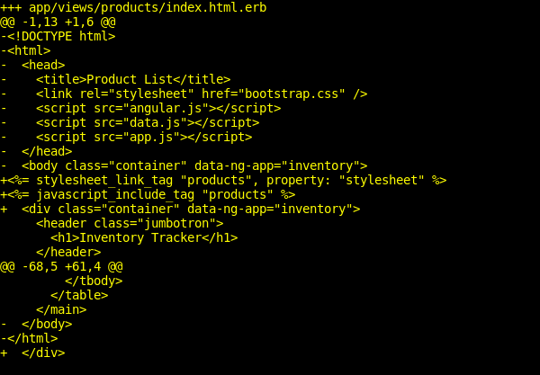
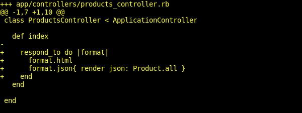
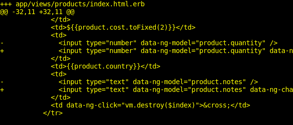

# Walkthrough of Inventory Tracker

> See the working solution here:

> https://wdi-inventory-tracker.herokuapp.com/products

## Setup

If you already have `inventory_tracker` on your computer, move into that app's directory and run:

```bash
$ git fetch
$ git checkout rails-starter
```

> Otherwise, clone down [this repo](https://github.com/ga-wdi-exercises/inventory_tracker) and checkout to the `rails-starter` branch.

---

Review the app for a minute to re-familiarize yourself.

This is an Angular app that has **no data persistence**: when you refresh the page, all your changes are gone.

Our goal is to put this app "on Rails".

## Rails New

> **Note**: Each header corresponds to a relative commit in the `rails-solution` branch of [this repo](https://github.com/ga-wdi-exercises/inventory_tracker/commits/rails-solution).

To start things off, we need to create a new Rails app in the current directory:

```
$ rails new . -d postgresql
```

<details>
<summary>
**Q**. Why are we doing `rails new .` ?
</summary>
<br>
```
We want to create a new Rails app and have all those files go in the current directory
```
</details>


## Move the Angular Files

**Read first**:

Now that we have a Rails skeleton in our application, we are going to need to do some setup and configuration so that our Angular files are loaded and served from the right places. In order to do that, at at a high level we need to do 3 things:

1. Use the `products` "index" view to load our Angular app
2. Turn the contents of the `data.js` file into a JSON file, which we'll use for seed data.
3. Move our static assets(`app.js`, `angular.js`, etc.) into the appropriate locations

When it comes down to deciding where to put our static content (images/css/js), Rails has several options related to how we should organize
our assets.

Each of the following directories contain an important role in the Rails Asset Pipeline:

- `app/assets`: Code that is specific to certain models in your app: for example, the CSS and JS just for your `Product` model would go in `product.css` and `product.js`. Putting everything in `application.js` and `application.css` is technically a bad practice (but is just fine for small, simple apps).
- `lib/assets`: Libraries that you write yourself. For instance, if you wrote a whole bunch of helper Javascript functions for your Rails app (code that you would use on multiple pages that isn't specific to one model) you might put it here.
- `vendor/assets`: Third-party libraries, like jQuery, Angular, D3, Bootstrap, Foundation, and so on. "Vendor" means third-parties that provide you with code (not someone selling you stuff).
- `public/`: Rarely used (directly). Where your assets go in production after being compiled. Anything in `public` is accessible by going to `localhost:3000/the_file.whatever`. For example, `public/404.html` is accessible at `localhost:3000/404.html` (so when you want to customize your error pages, you do it here). HTML in `public/` has access only to those assets that are also in `public`.

[More information here.](http://guides.rubyonrails.org/asset_pipeline.html#asset-organization)

**Then move these files to their appropriate locations**

Rename the files as described. If a folder doesn't already exist, you'll need to create it.

```
app.js              => app/assets/javascripts/products.js
index.html          => app/views/products/index.html.erb
data.js             => db/products_data.json
angular.js          => vendor/assets/javascripts/angular.js
angular-resource.js => vendor/assets/javascripts/angular-resource.js
bootstrap.css       => vendor/assets/stylesheets/bootstrap.css
```

---

## Get the `Index` View to Show Up

Great, now that you know a little bit more about the Rails Asset Pipeline, and our Angular assets are in the right place for now, let's work on building out the Rails view that will eventually serve our Angular app.

We need to:

  - Create a new controller for `products` and define and `index` action
  - Create routes for `products`

After we do that, let's start our server and view the page in our browser:

```bash
$ rake db:create
$ rails s
```

**Think**: What URL will you need to go to? You haven't defined a root URL!

**Think**: Why aren't assets working?

## STOP

-----

## Load Angular assets on Products `Index` View

Ok, we can see remnants of our Angular app, but it doesn't exactly look right and Angular is not loading...we'll fix that in this step.

However, we don't want the Inventory Tracker Angular stuff to be loaded on every page -- just the `products#index` page.

>  Loading it on every page would be grossly inefficient since we want to use it only on one page.

The Rails "Asset Pipeline" loads, consolidates, and minifies assets (Javascript, CSS, etc). Out-of-the-box, it takes all your Javascript and puts it in one file, and takes all your CSS and puts it in one file. This is called "precompiling".

We no longer want to do this.

#### First, tell Rails to *not* automatically put all the CSS and JS into one file

To do this, remove only the `require_tree` line from:

- `app/assets/stylesheets/application.css`
- `app/assets/javascripts/application.js`

**Q**. If you had to guess, what does `require_tree do?`

> **Note**: the Rails asset pipeline uses a special comment syntax to load asset files. If you get funny behavior, make sure you haven't deleted those comments in `app/assets/javascripts/application.js` and `app/assets/stylesheets/application.css`

#### Second, include the third-party libraries

<details>
<summary>
**Q**. What external dependencies does our app need to run?
</summary>
<br>
```
Angular, ng-resource, and Bootstrap
```
</details>

<br>

Using the same formats as in `application.js` and `application.css` (they're each a little different because they're different languages), you can "require" any file that's in any of the "assets" folders, including `vendor/assets`. This will cause it to be included in the precompilation.

Make the `products.js` include Angular and ngResource, and create a `products.css` that includes Bootstrap.


#### Third, tell Rails to precompile the Product CSS and JS files

Since we removed the `require_tree` line from our `application` level `css` and `js` files, we need to tell Rails to explictly precompile our custom static assets: `product.css` and `product.js`

Read the comment at the end of `config/initializers/assets.rb`.


#### Fourth, include the Product JS and CSS files in your Product#index view

> **Hint** in order to link to assets that will be precompiled, we need to use Rails' special link helpers. We can use `stylesheet_link_tag` for any `css` files and `javascript_include_tag` for any `js` files.

Also, **make the HTML valid**. Remember that *everything* in this file will be inserted into `layouts/application.html.erb` (which we're not touching at all). You don't want a `<body>` inside a `<body>`.



> **Note**: Because these `<link>` tags aren't in the `<head>`, they won't validate. In order to make them validate you can add a `property="stylesheet"` attribute.

#### Fifth, restart your server

Rails won't pick up all these changes automatically.

## STOP

-----

## Add model, migrations, and seeds

Great now that we have our assets loading correctly, we need to work on getting data to our Angular app. To do this, we are going to build out our internal API.

#### 1. Create a Product migration
> **Note**: think about which columns we need to add

#### 2. Create a Product model

#### 3. Convert the `db/products_data.json` to valid JSON
> **Hint**: You only need to change 11 characters.

#### 4. Load the JSON in the seeds file
> in `db/seeds.rb`, read the `products_data.json` file and parse it as `JSON`


#### 5. DCMS!
> Drop, Create, Migrate, and Seed your database

You know it worked if you can go into `rails c` and can view all `products`

---

## Break

---
## Make the `Products#index` action render either JSON or HTML

Awesome, now that we have our database working and correctly populated, we need to work on having Rails serve that data.

To do this, we need to modify our products `index` controller action to return the appropriate response depending on the format of the request.

Thankfully, Rails gives us the `respond_to` helper method which can be used in a controller, and is a method that tells Rails to do one thing when a route is requested with `.json` at the end of it, and another thing without `.json`.

We're going to use the same route to show either the Inventory Tracker app, or the `JSON` of all the Products, depending on the format of the request.

In `app/controllers/products_controller`, modify the `index` action like so:



**Q.** Where does value of the `format` part of the `respond_to` block come from?

You know it worked if you visit `http://localhost:3000/products.json` in your browser and you see all your `products` as `json`

## Make Angular load the products from the database

So we now have the ability to serve data from our back-end, we need to focus on how we are going to get Angular to load in those `products` from our database. How did we do it when we were connecting to a third-party api?

<details>
<summary>
**Q**. What library can we use to allow us to easily consume a RESTful api in Angular?
</summary>
<br>

```
The ng-resource library, and specifically the $resource module
```
</details>

<br>

Ok, all that to say, we need to update `products.js` to use ngResource.

**Q**. What steps do we need to take in order to use `ngResource` and its components?

---

We need to:

- Inject `ngResource` as dependency to our main `module`
- Inject `$resource` as


We need to inject `$resource` as a dependency for our `InventoryController` and then configure it to hit our api endpoint. The object that is returned as a result will serve as the interface for our back-end data fetching queries.

Great, now our Inventory Tracker should load real data!

**Think**: What changes are made to the database when we click the "X" (remove) button?

## Make the `product.cost` show up

Looks like all of our data is displaying...except for a product's `cost`. **Why is that?**

This is because the data we received from Rails is `cost` as a string. We'll need to convert it to a float.

We can do this using Javascript:

- Loop through each product returned from the `response` of `Product.query()`
- Set each `product`'s cost to the parsed float of the cost

**Questions?**

# STOP
-----

## Break

---

## Add `destroy` method

Next up on our to-do list is to make the User's actions on the front end update the data in our database in real-time. To do this, we are going to use our factory model to make the appropriate AJAX requests for each relevant CRUD action.

### First, let Angular destroy a Product

- Use your factory to remove the correct Product
- After the product has been removed, remove the product from `vm.products`

#### Think: Why doesn't it work?

### Second, provide a controller method for destroying a Product

- Define a controller action for Destroy
- Find the product and destroy it
- Render as a JSON a hash `{success: true}`

#### Think: Why doesn't it work?

### Third, tell the Application Controller to allow CRUD via AJAX


> **Note**: we will not be doing this often, where we comment out the `protect_from_forgery` line in `application_controller.rb`. This can lead to security concerns in the long-run, since we are opening up our app to AJAX requests from anyone. But in the interest of time and since we are still in development, we are going to take the easy way out.

> If you are interested in another more elegant work around, there is a way to turn the protection off depending on the request type / origin, etc. More info can be found [here](http://stackoverflow.com/questions/9362910/rails-warning-cant-verify-csrf-token-authenticity-for-json-devise-requests)


## Add Create method

Continuing on to build out our app's Create functionality, we need to modify our Angular `create` method to make the appropriate call to our DB, and on the Rails side, we need to setup the back-end endpoint to handle the request.

### First, enable it in Angular

- Use the factory to save our new product
- Convert the returned response's cost to a float
- Add the response to `vm.products`

### Second, enable it in the Controller

We can still use strong params!

- Define a Create method in the products controller
- Define and use strong params to create a product
- Render that product as json

## Add Update method

Angular doesn't "know" *when* we want to save our changes to the database, and it doesn't know *how*.

<!-- What feature of Angular makes this so?  -->

> There is this thing called `$scope.$watch` that you may see referenced that automates this process, but generally it's advised against.

### First, enable it in Angular

We'll create a method that sends a PUT request to the database.


### Second, enable it in the view

We can tell Angular when to fire the update method using `data-ng-change`.

#### Think: Oh no! The screenshot is cut off!

Guess you'll have to figure out for yourself what goes in there.



### Third, enable it in the controller


# STOP
-----

# Bonus

## Commit: [Deploy](https://github.com/ga-wdi-exercises/inventory_tracker/commit/5ee1fac7903683a9ded45101b34d228bc39cbf3a)

### First, add 12Factor to the Gemfile

Don't forget to `bundle install` afterward and restart your server.


### Second, push to Heroku

```
$ heroku create
$ git push heroku master
$ heroku rake db:migrate
$ heroku rake db:seed
$ heroku open
```

You get an error! Use `heroku logs -t` to find the cause.

### Second, set your secret key

You may have noticed a `secrets.yml` file before in your other Rails apps. It doesn't exist here -- it's in `.gitignore`.

`secrets.yml` contains a secret code that is used to generate authenticity tokens for your app -- basically, to make sure it's *you* who's running your app. Rails won't deploy without that code, but it doesn't necessarily need to be in `secrets.yml`.

Good practice is to **NOT** push this secret code to Github nor anything else, just as it's good practice to not push API keys.

> We haven't worried about this so far because it's really only important when you have lots of users and/or are storing sensitive data.

Add the following line to the `config/environments/production` file:


This tells Rails to look for the secret key in the environment variables.

Then, you'll generate a new secret key using Rails' built in `rake secret`, and tell Heroku to use that as an environment variable.

```bash
$ rake secret
# Copy the output
$ heroku config:set SECRET_KEY_BASE=whatyoucopied
```

*Now* try again to view it in your browser.
